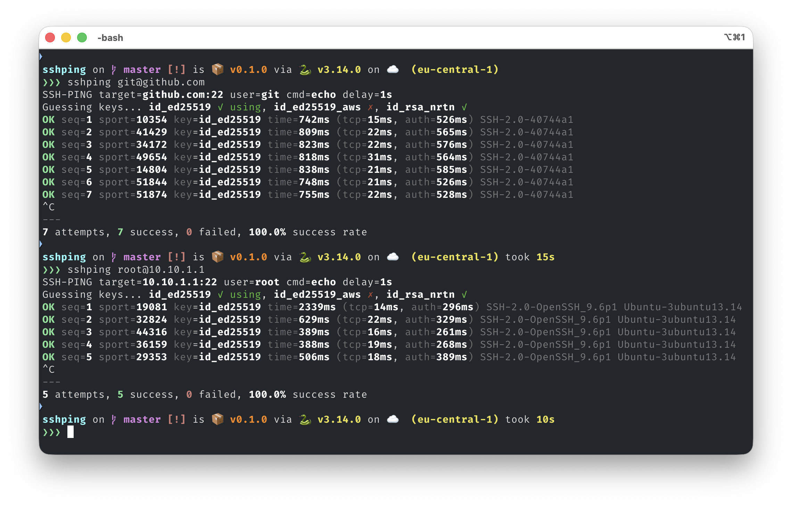

# sshping

Ping-style SSH authentication tester. Tests full SSH auth with real connections, not just TCP.



## Install

```bash
# with pip
pip install git+https://nrtn.dev/catalyst/sshping.git

# with uv
uv tool install git+https://nrtn.dev/catalyst/sshping.git
```

## Usage

```bash
sshping [user@]host[:port]
```

### Options

- `-i KEY` - SSH private key (default: auto-detect from ~/.ssh)
- `-d DELAY` - Delay between attempts in seconds (default: 1)
- `-t TIMEOUT` - SSH timeout in seconds (default: 3)

### Examples

```bash
# Basic
sshping git@github.com

# Specific key
sshping -i ~/.ssh/id_rsa git@github.com

# Custom timing
sshping -t 5 -d 0.5 git@github.com

# IPv6
sshping user@[2001:db8::1]:22
```

## Output

```
❯❯❯ sshping git@github.com
SSH-PING target=github.com:22 user=git delay=1s
Guessing keys... id_ed25519 ✓ using, id_ed25519_aws ✗, id_rsa_nrtn ✓
OK seq=1 sport=52968 key=id_ed25519 time=566ms (tcp=15ms, auth=551ms) SSH-2.0-40744a1
OK seq=2 sport=63607 key=id_ed25519 time=608ms (tcp=16ms, auth=591ms) SSH-2.0-40744a1
^C
---
2 attempts, 2 success, 0 failed, 100.0% success rate
```

Exit with Ctrl+C - shows summary stats.
